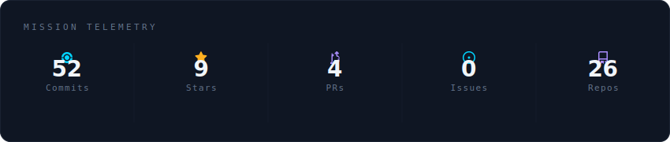

## 👨‍💻️ Sobre Mim

Me chamo **Luiz Otávio de Almeida**, tenho 21 anos e sou do interior do Paraná. Concluí meu ensino médio integrado ao técnico em Eletromecânica em 2023 no Instituto Federal do Paraná (IFPR). Atualmente, curso **Tecnologia de Sistemas para Internet (TSI)** na mesma instituição. 

Tenho me dedicado profundamente ao ecossistema **Back-End**, com foco principal na linguagem **Java** e no framework **Spring Boot**. Minha atuação envolve a arquitetura e criação de APIs RESTful seguras, implementando autenticação com JSON Web Token (JWT), regras de negócio complexas, testes automatizados e integrações com banco de dados. Tenho também forte atuação no Front-End reativo utilizando **Angular**.

---

## 🚀 Tecnologias e Ferramentas

  
  
  
  
  
  
  
  
  
  

 

  

 

  

 

  

 

  

